# 🚀 Quickmi - Role-Based Parcel & Delivery Mobile App

Quickmi is a modern, role-based parcel delivery mobile application built with **Expo (SDK 54)**, **React Native**, **Expo Router**, **Redux Toolkit**, and **NativeWind (Tailwind CSS)**. It delivers separate, tailored experiences for both **Customers (Users)** placing parcel orders and **Riders/Agents** accepting and fulfilling delivery tasks.

---

## 📱 App Screenshots

<div align="center">
  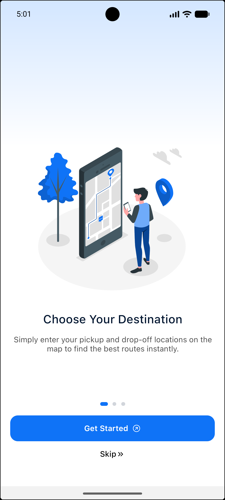
  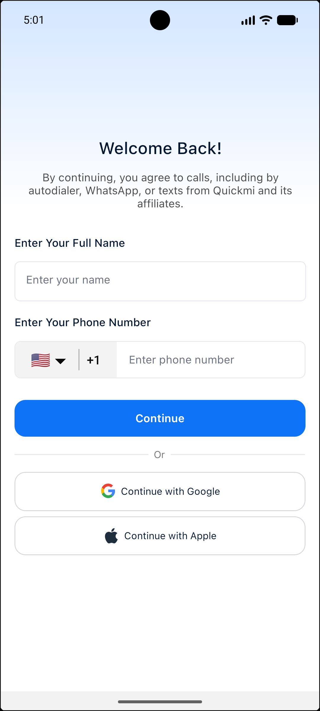
  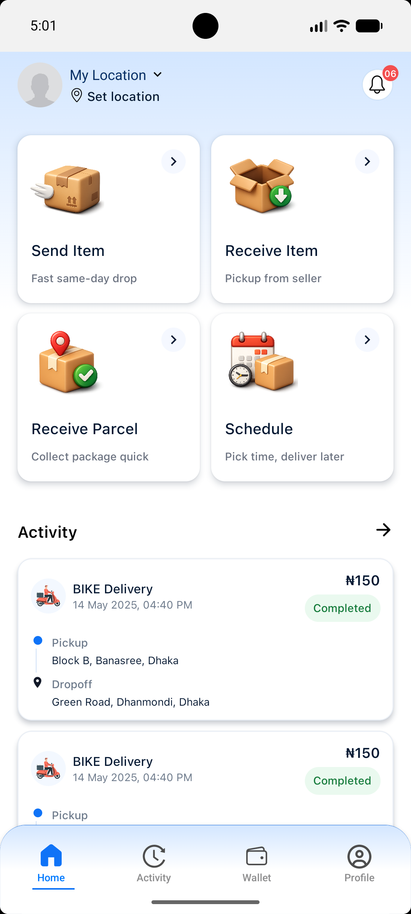
  <br/><br/>
  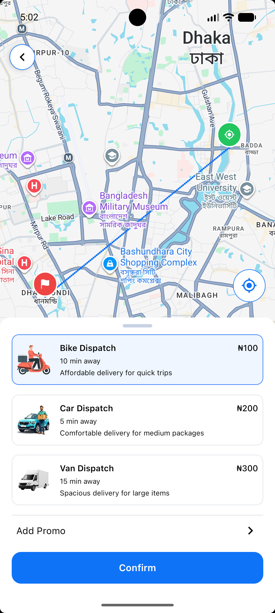
  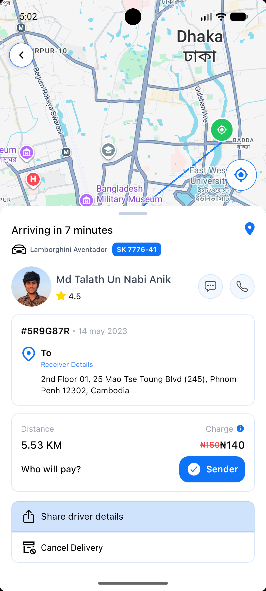
  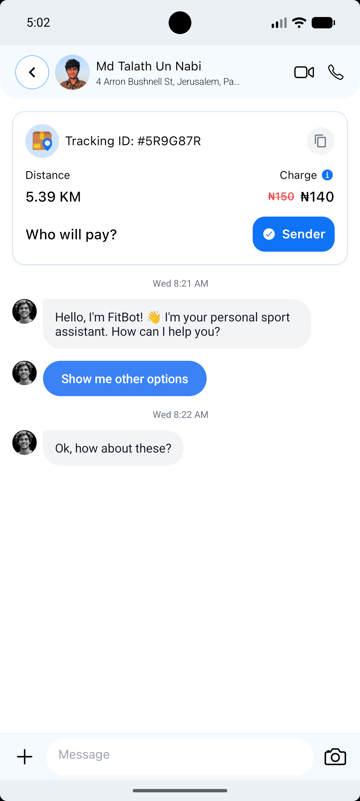
  <br/><br/>
  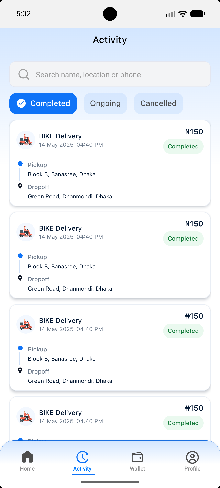
  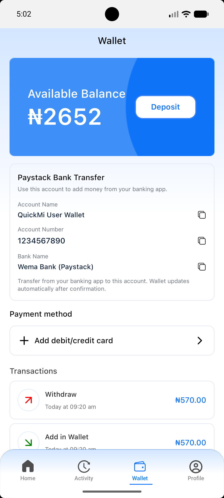
  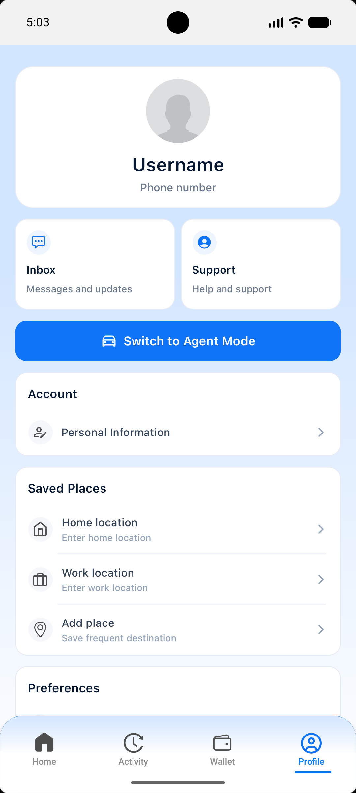
  <br/><br/>
  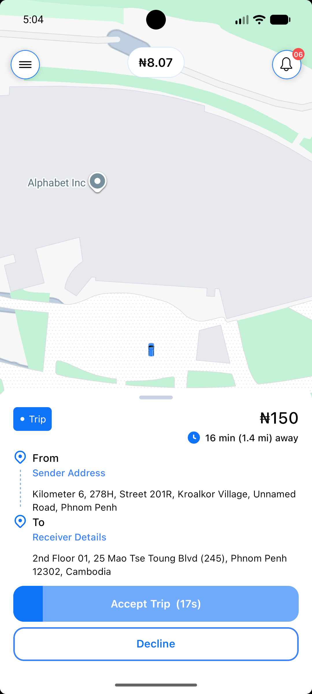
  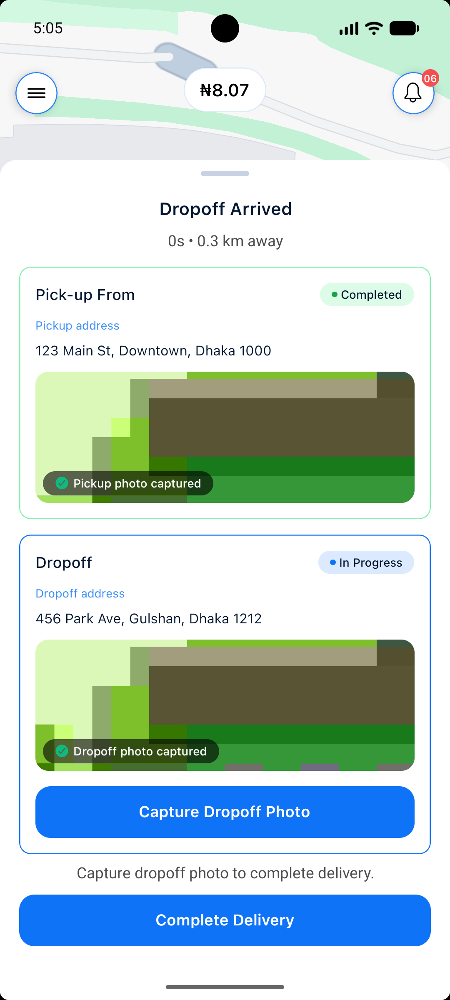
</div>

---

## ✨ Features

### 👤 Dual-Role Experience
- **Role Selection**: Dynamic onboarding route persistence for `User` (Customer) or `Rider` (Agent).
- **Persistent App Gates**: Role selection, onboarding status, and auth gates stored locally via `AsyncStorage`.

### 📦 Customer / User Flow
- **Interactive Home Screen**: Quick access to instant, scheduled, and parcel delivery services.
- **Booking & Vehicle Selection**: Interactive map with vehicle options (bike, car, van) and multi-step booking bottom sheet.
- **Order History & Tracking**: View active, completed, and canceled delivery trips.
- **Profile & Settings**: Address management, payment options, notifications, and app preferences.

### 🛵 Rider / Agent Flow
- **Agent Verification (KYC)**: Document upload flow for new agent registration.
- **Map Dashboard & Live Tracking**: Real-time map view with location permissions (`expo-location` + `react-native-maps`).
- **Interactive Ride Management**: Accept offers, view price estimations, navigate trip milestones, and update order status via dynamic bottom sheets.

### 🔐 Auth & Onboarding
- **Multi-step Onboarding**: 3-step feature walkthrough.
- **Phone Authentication**: Country code selection, phone validation, and OTP verification screens.

---

## 🛠️ Tech Stack

- **Core**: [Expo SDK 54](https://expo.dev/) (React Native `0.81.5`, React `19`)
- **Navigation**: [Expo Router v6](https://docs.expo.dev/router/introduction/) (File-based routing)
- **State Management**: [Redux Toolkit](https://redux-toolkit.js.org/) + [React Redux](https://react-redux.js.org/)
- **Styling**: [NativeWind v4](https://www.nativewind.dev/) (Tailwind CSS for React Native)
- **Maps & Geolocation**: `react-native-maps`, `expo-location`
- **UI & Animation**: `@gorhom/bottom-sheet`, `expo-linear-gradient`, `expo-image`, `@expo/vector-icons`
- **Storage**: `@react-native-async-storage/async-storage`

---

## 📁 Project Structure

```txt
quickmi/
├── app/                        # Expo Router application structure
│   ├── _layout.tsx             # Root layout with font loading & Redux provider
│   ├── index.tsx               # Auth & onboarding router gate check
│   ├── role-selection.tsx      # Initial role selection screen
│   ├── (onboarding)/           # Step-by-step onboarding screens
│   ├── (auth)/                 # Sign up & OTP verification
│   ├── (user)/                 # User/Customer bottom tabs & booking screens
│   ├── (agent)/                # Rider/Agent dashboard & delivery management
│   ├── (agent-verification)/   # Agent KYC document upload flow
│   └── (shared)/               # Chat, notifications, settings, & profile sub-screens
├── assets/                     # Fonts, icons, images & screenshots
│   └── screenshots/            # UI screenshots
├── components/                 # Reusable UI components & bottom sheet modals
├── store/                      # Redux Toolkit store & RTK Query APIs
├── utils/                      # Storage helpers & utility hooks
├── app.config.js               # Expo project & native configuration
└── tailwind.config.js          # Tailwind CSS design system configuration
```

---

## 🔑 Environment Setup

Create a `.env` file in the root directory (refer to `.env.example`):

```env
GOOGLE_MAPS_API_KEY_ANDROID=your_android_maps_key
GOOGLE_MAPS_API_KEY_IOS=your_ios_maps_key
```

---

## 🚀 Getting Started

### 1. Install Dependencies

```bash
npm install
```

### 2. Platform Commands

- **Android**: `npm run android`
- **iOS**: `npm run ios`
- **Web**: `npm run web`

### 3. Prebuild & Device Run Commands

- **Clean Prebuild Native Folders**:
  ```bash
  npx expo prebuild --clean
  ```
- **Run on Physical Device / Emulator**:
  ```bash
  npx expo run:android --device
  # or for iOS
  npx expo run:ios --device
  ```


---

## 📜 License

### 4. 🚫 Creative Commons Non-Commercial (CC BY-NC 4.0)

This project and its assets are licensed under the **Creative Commons Attribution-NonCommercial 4.0 International License (CC BY-NC 4.0)**. Please refer to the [LICENSE](./LICENSE) file for full terms and conditions.
